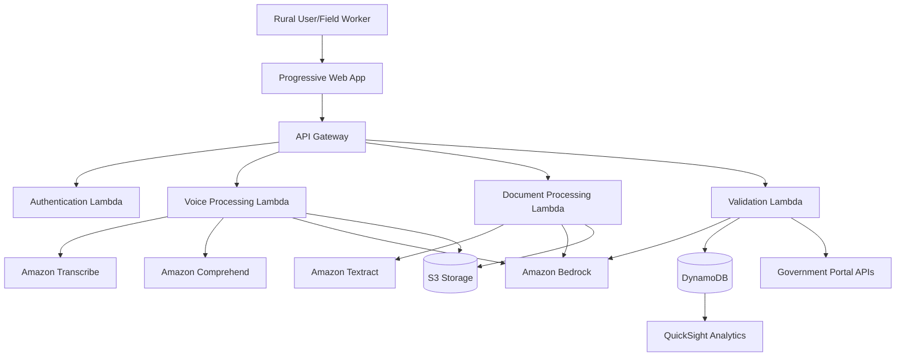
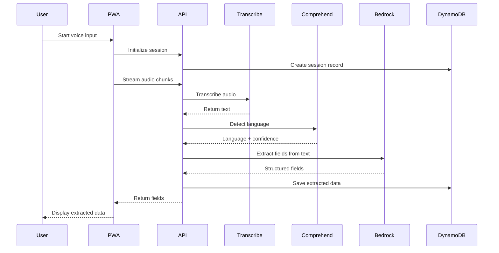
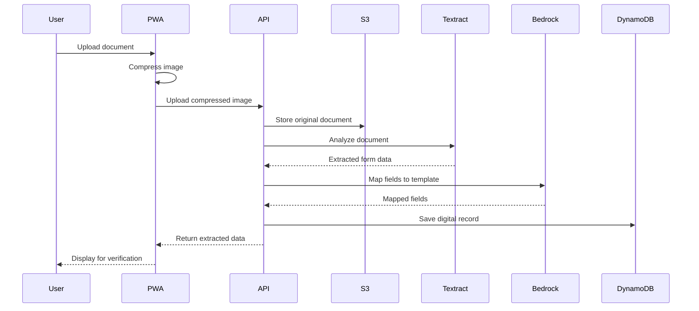
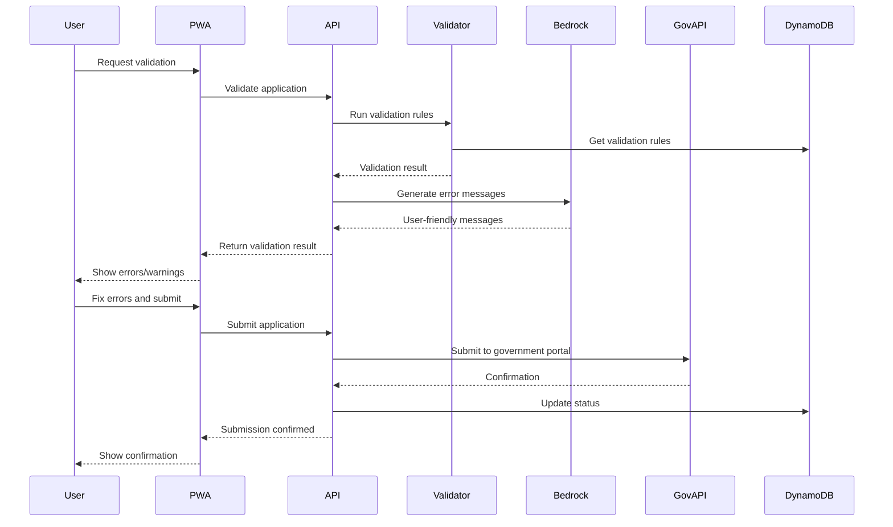

# Design Document: Grameen File Intelligence System (GFIS)

## Overview

The Grameen File Intelligence System (GFIS) is a serverless, cloud-native application built on AWS infrastructure that enables rural citizens and field workers to create, validate, and submit government service applications through voice and document scanning interfaces. The system leverages AWS AI/ML services to provide multi-language support, intelligent form validation, and rejection analysis while optimizing for low-bandwidth rural connectivity.

The architecture follows a microservices pattern with serverless compute, event-driven processing, and managed AI services to minimize operational overhead and scale automatically with demand. The system prioritizes accessibility, offline capability, and data security while maintaining integration with existing government portals.

## Architecture

### High-Level Architecture

The system consists of the following major components:

1. **Frontend Layer**: Progressive Web App (PWA) optimized for low-bandwidth, offline-first operation
2. **API Layer**: Amazon API Gateway with Lambda functions for business logic
3. **AI/ML Services Layer**: AWS managed services for voice, language, and document processing
4. **Data Layer**: DynamoDB for structured data, S3 for document storage
5. **Integration Layer**: Connectors to government portals and external systems
6. **Analytics Layer**: QuickSight dashboards for reporting and insights

### Component Interaction Flow



### Technology Stack

- **Frontend**: React PWA with service workers, IndexedDB for offline storage
- **API Gateway**: REST APIs with request validation and throttling
- **Compute**: AWS Lambda (Node.js/Python) with provisioned concurrency for critical paths
- **AI/ML Services**:
  - Amazon Transcribe: Speech-to-text with custom vocabulary for Indian languages
  - Amazon Comprehend: Language detection and entity extraction
  - Amazon Bedrock: LLM for natural language understanding, validation guidance, and rejection analysis
  - Amazon Textract: OCR for document scanning with form detection
- **Storage**:
  - DynamoDB: Application data with single-table design
  - S3: Document storage with lifecycle policies and encryption
- **Security**: Cognito for authentication, KMS for encryption, WAF for API protection
- **Monitoring**: CloudWatch for logs and metrics, X-Ray for distributed tracing

## Components and Interfaces

### 1. Voice Input Module

**Responsibilities**:
- Capture audio input from user device
- Stream audio to Amazon Transcribe for real-time transcription
- Detect language using Amazon Comprehend
- Extract structured field values from natural language using Bedrock

**Interfaces**:

```typescript
interface VoiceInputModule {
  // Start audio capture session
  startCapture(sessionId: string, languageHint?: string): Promise<CaptureSession>;
  
  // Stop audio capture and get transcription
  stopCapture(sessionId: string): Promise<TranscriptionResult>;
  
  // Process transcribed text to extract form fields
  extractFields(text: string, formTemplate: FormTemplate): Promise<ExtractedFields>;
  
  // Validate audio quality
  checkAudioQuality(audioData: AudioBuffer): AudioQualityResult;
}

interface TranscriptionResult {
  sessionId: string;
  text: string;
  language: string;
  confidence: number;
  timestamp: Date;
}

interface ExtractedFields {
  fields: Map<string, FieldValue>;
  confidence: Map<string, number>;
  ambiguities: string[];
}
```

**Implementation Details**:
- Use WebRTC for browser-based audio capture with fallback to MediaRecorder API
- Stream audio chunks to Lambda function that forwards to Transcribe
- Configure Transcribe with custom vocabulary for government terminology
- Use Bedrock with prompt engineering to map natural language to form fields
- Implement retry logic with exponential backoff for transient failures

### 2. Document Scanner Module

**Responsibilities**:
- Accept document uploads (images/PDFs)
- Process documents through Amazon Textract
- Extract form fields and values
- Map extracted data to Digital Record schema

**Interfaces**:

```typescript
interface DocumentScanner {
  // Upload and process document
  scanDocument(file: File, applicationType: string): Promise<ScanResult>;
  
  // Check image quality before processing
  validateImageQuality(file: File): Promise<QualityCheck>;
  
  // Process multi-page documents
  scanMultiPageDocument(files: File[]): Promise<ScanResult>;
  
  // Map extracted data to form template
  mapToTemplate(scanResult: ScanResult, template: FormTemplate): Promise<MappedData>;
}

interface ScanResult {
  documentId: string;
  extractedText: string;
  formFields: DetectedField[];
  confidence: number;
  pages: number;
}

interface DetectedField {
  key: string;
  value: string;
  confidence: number;
  boundingBox: BoundingBox;
}
```

**Implementation Details**:
- Compress images client-side before upload (target 85% quality, max 2MB)
- Use Textract AnalyzeDocument API with FORMS feature
- Implement field mapping logic using fuzzy matching for field names
- Store original documents in S3 with encryption at rest
- Generate thumbnails for user verification

### 3. Form Validator Module

**Responsibilities**:
- Validate completeness of required fields
- Check data format against government specifications
- Detect logical inconsistencies
- Generate user-friendly error messages

**Interfaces**:

```typescript
interface FormValidator {
  // Validate complete application
  validateApplication(application: DigitalRecord): Promise<ValidationResult>;
  
  // Validate single field
  validateField(fieldName: string, value: any, context: ApplicationContext): Promise<FieldValidation>;
  
  // Check cross-field dependencies
  validateDependencies(application: DigitalRecord): Promise<DependencyValidation[]>;
  
  // Generate validation summary
  getValidationSummary(application: DigitalRecord): Promise<ValidationSummary>;
}

interface ValidationResult {
  isValid: boolean;
  errors: ValidationError[];
  warnings: ValidationWarning[];
  completeness: number; // 0-100 percentage
}

interface ValidationError {
  fieldName: string;
  errorCode: string;
  message: string;
  severity: 'critical' | 'high' | 'medium';
  correctionGuidance: string;
}
```

**Implementation Details**:
- Load validation rules from DynamoDB based on form template
- Implement rule engine for complex validation logic
- Use Bedrock to generate natural language error messages
- Cache validation rules in Lambda memory for performance
- Support scheme-specific validation plugins

### 4. Language Processor Module

**Responsibilities**:
- Detect spoken/written language
- Translate interface elements
- Generate culturally appropriate messages
- Handle transliteration for technical terms

**Interfaces**:

```typescript
interface LanguageProcessor {
  // Detect language from text
  detectLanguage(text: string): Promise<LanguageDetection>;
  
  // Translate text to target language
  translate(text: string, targetLanguage: string): Promise<Translation>;
  
  // Get localized interface strings
  getLocalizedStrings(language: string): Promise<LocalizationBundle>;
  
  // Transliterate technical terms
  transliterate(term: string, targetScript: string): Promise<string>;
}

interface LanguageDetection {
  language: string;
  confidence: number;
  alternativeLanguages: string[];
}

interface Translation {
  originalText: string;
  translatedText: string;
  sourceLanguage: string;
  targetLanguage: string;
}
```

**Implementation Details**:
- Use Amazon Comprehend for language detection
- Maintain translation cache in DynamoDB for common phrases
- Use Amazon Translate for interface translations
- Implement fallback chain: cache → Translate → English
- Store localization bundles in S3 with CloudFront distribution

### 5. Rejection Analyzer Module

**Responsibilities**:
- Parse official rejection reasons
- Identify specific problematic fields
- Generate simple explanations
- Provide correction guidance

**Interfaces**:

```typescript
interface RejectionAnalyzer {
  // Analyze rejection reason
  analyzeRejection(rejectionText: string, application: DigitalRecord): Promise<RejectionAnalysis>;
  
  // Generate correction steps
  generateCorrectionSteps(analysis: RejectionAnalysis): Promise<CorrectionGuidance>;
  
  // Translate rejection to simple language
  simplifyRejectionReason(rejectionText: string, targetLanguage: string): Promise<string>;
}

interface RejectionAnalysis {
  rejectionId: string;
  category: string;
  affectedFields: string[];
  rootCause: string;
  severity: string;
}

interface CorrectionGuidance {
  steps: CorrectionStep[];
  estimatedTime: number;
  requiredDocuments: string[];
}

interface CorrectionStep {
  stepNumber: number;
  description: string;
  fieldToModify: string;
  example: string;
}
```

**Implementation Details**:
- Use Bedrock with few-shot prompting to parse rejection text
- Maintain rejection pattern database in DynamoDB
- Generate step-by-step guidance using LLM
- Track rejection patterns for analytics
- Provide examples from successful applications

### 6. Digital Record Manager

**Responsibilities**:
- Create and manage Digital Records
- Maintain version history
- Handle encryption/decryption
- Manage record lifecycle

**Interfaces**:

```typescript
interface DigitalRecordManager {
  // Create new digital record
  createRecord(data: ApplicationData, userId: string): Promise<DigitalRecord>;
  
  // Update existing record
  updateRecord(recordId: string, updates: Partial<ApplicationData>): Promise<DigitalRecord>;
  
  // Retrieve record with history
  getRecord(recordId: string): Promise<DigitalRecord>;
  
  // List user's records
  listRecords(userId: string, filters?: RecordFilters): Promise<DigitalRecord[]>;
  
  // Delete record (soft delete)
  deleteRecord(recordId: string): Promise<void>;
}

interface DigitalRecord {
  recordId: string;
  userId: string;
  applicationType: string;
  status: ApplicationStatus;
  data: ApplicationData;
  version: number;
  createdAt: Date;
  updatedAt: Date;
  submittedAt?: Date;
  metadata: RecordMetadata;
}

type ApplicationStatus = 'draft' | 'validated' | 'submitted' | 'approved' | 'rejected' | 'resubmitted';
```

**Implementation Details**:
- Use DynamoDB single-table design with composite keys
- Implement optimistic locking with version numbers
- Encrypt sensitive fields using KMS before storage
- Store version history in separate DynamoDB table
- Implement TTL for deleted records (90 days retention)

## Data Models

### DynamoDB Schema (Single-Table Design)

**Primary Table: GFIS_Data**

Partition Key: `PK` (string)
Sort Key: `SK` (string)

**Access Patterns**:

1. Get user profile: `PK=USER#<userId>`, `SK=PROFILE`
2. List user applications: `PK=USER#<userId>`, `SK begins_with APPLICATION#`
3. Get application: `PK=APPLICATION#<appId>`, `SK=METADATA`
4. Get application version: `PK=APPLICATION#<appId>`, `SK=VERSION#<versionNum>`
5. List templates: `PK=TEMPLATE`, `SK begins_with <templateType>`
6. Get validation rules: `PK=VALIDATION#<templateId>`, `SK=RULES`

**Entity Types**:

```typescript
// User Profile
{
  PK: "USER#<userId>",
  SK: "PROFILE",
  phoneNumber: string,
  preferredLanguage: string,
  location: {
    state: string,
    district: string,
    block: string
  },
  createdAt: string,
  lastLoginAt: string,
  GSI1PK: "USERS_BY_LOCATION",
  GSI1SK: "<state>#<district>"
}

// Application Record
{
  PK: "USER#<userId>",
  SK: "APPLICATION#<appId>",
  recordId: string,
  applicationType: string,
  status: string,
  data: {
    // Encrypted application fields
  },
  version: number,
  createdAt: string,
  updatedAt: string,
  submittedAt?: string,
  GSI1PK: "APPLICATIONS_BY_STATUS",
  GSI1SK: "<status>#<createdAt>"
}

// Application Metadata
{
  PK: "APPLICATION#<appId>",
  SK: "METADATA",
  userId: string,
  applicationType: string,
  status: string,
  validationScore: number,
  submissionAttempts: number,
  rejectionCount: number,
  lastRejectionReason?: string
}

// Form Template
{
  PK: "TEMPLATE",
  SK: "<templateType>#<version>",
  templateId: string,
  name: string,
  version: string,
  fields: FieldDefinition[],
  validationRules: ValidationRule[],
  isActive: boolean,
  createdAt: string
}

// Validation Rules
{
  PK: "VALIDATION#<templateId>",
  SK: "RULES",
  rules: {
    fieldName: {
      required: boolean,
      type: string,
      pattern?: string,
      minLength?: number,
      maxLength?: number,
      dependencies?: string[]
    }
  }
}
```

### S3 Bucket Structure

```
gfis-documents-<env>/
├── audio/
│   └── <userId>/
│       └── <sessionId>/
│           └── audio.webm
├── documents/
│   └── <userId>/
│       └── <applicationId>/
│           ├── original.pdf
│           └── thumbnail.jpg
├── templates/
│   └── <templateId>/
│       └── template.json
└── localization/
    └── <language>/
        └── strings.json
```

### API Data Models

```typescript
// Request/Response Models

interface CreateApplicationRequest {
  applicationType: string;
  inputMethod: 'voice' | 'document' | 'manual';
  language: string;
  data?: Partial<ApplicationData>;
}

interface CreateApplicationResponse {
  applicationId: string;
  status: string;
  nextSteps: string[];
}

interface SubmitApplicationRequest {
  applicationId: string;
  finalReview: boolean;
}

interface SubmitApplicationResponse {
  submissionId: string;
  confirmationNumber: string;
  estimatedProcessingTime: string;
  trackingUrl: string;
}

interface ValidationResponse {
  isValid: boolean;
  completeness: number;
  errors: ValidationError[];
  warnings: ValidationWarning[];
  canSubmit: boolean;
}
```

## Data Flow Diagrams

### Voice Input Flow



### Document Scanning Flow



### Validation and Submission Flow




## Correctness Properties

A property is a characteristic or behavior that should hold true across all valid executions of a system—essentially, a formal statement about what the system should do. Properties serve as the bridge between human-readable specifications and machine-verifiable correctness guarantees.

### Property 1: Audio Capture Initialization

*For any* voice input session, when capture is initiated, the Voice_Input_Module should successfully start capturing audio data and return a valid session identifier.

**Validates: Requirements 1.1**

### Property 2: Field Extraction from Natural Language

*For any* transcribed text and form template, the Language_Processor should extract structured field values that can be mapped to the template's field definitions.

**Validates: Requirements 1.5**

### Property 3: Sensitive Data Encryption at Rest

*For any* data containing sensitive fields (personal information, financial data, identity documents), the stored representation should be encrypted using AES-256, and decryption should yield the original data (round-trip property).

**Validates: Requirements 1.7, 6.6, 10.3**

### Property 4: Multi-Page Document Order Preservation

*For any* multi-page document upload, the processed pages should maintain the same order as the original document, such that page N in the input corresponds to page N in the output.

**Validates: Requirements 2.6**

### Property 5: Document Data to Digital Record Mapping

*For any* extracted document data and form template, all extracted fields should be mapped to valid Digital_Record fields according to the template schema.

**Validates: Requirements 2.7**

### Property 6: Required Field Validation

*For any* Digital_Record and form template, validation should fail if any field marked as required in the template is missing or empty in the record.

**Validates: Requirements 3.1**

### Property 7: Format Validation Against Specifications

*For any* field value and format specification (regex pattern, data type, length constraints), validation should reject values that don't conform to the specification.

**Validates: Requirements 3.2**

### Property 8: Cross-Field Logical Consistency

*For any* Digital_Record with dependent fields (e.g., end date must be after start date, child age must be less than parent age), validation should detect logical inconsistencies between related fields.

**Validates: Requirements 3.3**

### Property 9: Localized Error Messages

*For any* validation error and target language, the generated error message should be in the specified language and contain the field name and error description.

**Validates: Requirements 3.4, 5.4, 9.3, 14.1**

### Property 10: Error Severity Ordering

*For any* set of validation errors with different severity levels, the errors should be ordered such that critical errors appear before high-priority errors, which appear before medium-priority errors.

**Validates: Requirements 3.5**

### Property 11: Validation Success Confirmation

*For any* Digital_Record that passes all validation rules, a confirmation summary should be generated containing all field values for user review.

**Validates: Requirements 3.6**

### Property 12: Scheme-Specific Validation Rules

*For any* two different application types (schemes), the validation rules applied should differ according to their respective template specifications.

**Validates: Requirements 3.7**

### Property 13: Correction Guidance Generation

*For any* validation error, the system should generate correction instructions that include: the field name, the error description, and at least one example of correct format.

**Validates: Requirements 4.1, 4.2**

### Property 14: Field Help Text Availability

*For any* form field in a template, help text explaining why the information is required should be available and retrievable.

**Validates: Requirements 4.3**

### Property 15: Submission Blocking with Errors

*For any* Digital_Record with unresolved validation errors, submission attempts should be prevented and the errors should be highlighted to the user.

**Validates: Requirements 4.5**

### Property 16: Submission-Ready Record Generation

*For any* Digital_Record that passes validation, a submission-ready record should be generated that conforms to the government API specification format.

**Validates: Requirements 4.6, 13.1**

### Property 17: Rejection Text Parsing

*For any* official rejection text, the Rejection_Analyzer should parse it into structured data identifying at least: rejection category, affected fields, and root cause.

**Validates: Requirements 5.1, 5.2**

### Property 18: Technical Language Simplification

*For any* technical rejection reason, the Rejection_Analyzer should generate a simplified explanation using common vocabulary (avoiding jargon and technical terms).

**Validates: Requirements 5.3**

### Property 19: Rejection Correction Steps

*For any* analyzed rejection, the system should provide specific correction steps that include: step number, description, field to modify, and an example of correct data.

**Validates: Requirements 5.5**

### Property 20: Problematic Field Editability

*For any* rejection analysis identifying problematic fields, those fields should be marked as editable and accessible for user modification.

**Validates: Requirements 5.6**

### Property 21: Re-validation Before Resubmission

*For any* corrected application following rejection, validation should be performed again before allowing resubmission, and submission should only be allowed if validation passes.

**Validates: Requirements 5.7**

### Property 22: Standardized Field Names

*For any* Digital_Record created from voice or document input, all field names should conform to the standardized naming convention defined in the form template.

**Validates: Requirements 6.1**

### Property 23: Unique Application Identifiers

*For any* set of created Digital_Records, all application identifiers should be unique (no two records should have the same ID).

**Validates: Requirements 6.2**

### Property 24: Version History Maintenance

*For any* modification to a Digital_Record, a new version should be created with an incremented version number, and all previous versions should remain accessible.

**Validates: Requirements 6.3**

### Property 25: User Record Isolation

*For any* user querying their applications, the returned records should include all and only the records associated with that user's identifier (no records from other users).

**Validates: Requirements 6.4**

### Property 26: Status Update Tracking

*For any* application status change, the Digital_Record should be updated with the new status and a timestamp, and the update should be reflected in the version history.

**Validates: Requirements 6.5**

### Property 27: Data Compression for Transmission

*For any* data transmission, the payload should be compressed, and decompressing the transmitted data should yield the original data (round-trip property).

**Validates: Requirements 7.1**

### Property 28: Offline Data Caching and Sync

*For any* user input entered while offline, the data should be cached locally, and when connectivity is restored, syncing should transfer the cached data to the server without loss.

**Validates: Requirements 7.2, 7.4, 11.2, 11.3**

### Property 29: Critical Asset Load Prioritization

*For any* application load sequence, critical assets (core JavaScript, authentication, form templates) should be loaded before non-essential assets (analytics, images, optional features).

**Validates: Requirements 7.5**

### Property 30: Efficient Audio Codec Usage

*For any* voice data transmission, the audio should be encoded using an efficient codec (WebM Opus or AAC), and the encoded size should be significantly smaller than uncompressed PCM.

**Validates: Requirements 7.6**

### Property 31: Audio Feedback for User Actions

*For any* user interaction (button click, form submission, navigation), audio feedback should be triggered and played to the user.

**Validates: Requirements 8.2**

### Property 32: Menu Depth Limitation

*For any* navigation path in the interface, the menu depth should not exceed 2 levels (main menu → submenu → action).

**Validates: Requirements 8.3**

### Property 33: Voice Guidance in Selected Language

*For any* on-screen text when voice guidance is enabled, the text-to-speech output should be in the user's selected Regional_Language.

**Validates: Requirements 8.5**

### Property 34: Error Display with Multiple Indicators

*For any* error condition, the error message should include both textual description and a visual indicator (icon, color, or animation).

**Validates: Requirements 8.6**

### Property 35: Form Progress Tracking and Resume

*For any* in-progress form, the system should track completion percentage, allow saving at any point, and enable resuming from the saved state without data loss.

**Validates: Requirements 8.7**

### Property 36: Device Language Detection

*For any* first-time user access, the system should detect the device's language setting and offer it as the default interface language.

**Validates: Requirements 9.1**

### Property 37: Dual-Language Field Labels

*For any* form field label, both the Regional_Language term and the English term should be displayed to the user.

**Validates: Requirements 9.4**

### Property 38: Data Preservation During Language Switch

*For any* language change during an active session, all entered form data should remain unchanged, and only the interface language should update.

**Validates: Requirements 9.6**

### Property 39: Translation Fallback with Transliteration

*For any* term without available Regional_Language translation, the system should display the English term along with a transliteration in the target script.

**Validates: Requirements 9.7**

### Property 40: TLS Protocol Enforcement

*For any* network transmission of personal data, the connection should use TLS 1.3 or higher protocol.

**Validates: Requirements 10.2**

### Property 41: Authentication Requirement for Data Access

*For any* attempt to access user data, the system should require valid authentication credentials and reject unauthenticated requests.

**Validates: Requirements 10.4**

### Property 42: User Data Deletion Capability

*For any* Digital_Record owned by a user, the user should be able to request deletion, and the deletion should be executed (soft delete with retention period).

**Validates: Requirements 10.6**

### Property 43: Audit Log Completeness

*For any* data access event or template modification, an audit log entry should be created containing: timestamp, user/admin identifier, action type, and affected resource.

**Validates: Requirements 10.7, 15.7**

### Property 44: Offline Create and Edit Operations

*For any* application creation or edit operation performed while offline, the operation should succeed using local storage, and the data should be available for subsequent offline access.

**Validates: Requirements 11.1**

### Property 45: Offline Status Indication

*For any* period when network connectivity is unavailable, the interface should display a clear offline status indicator to the user.

**Validates: Requirements 11.5**

### Property 46: Connectivity-Dependent Feature Disabling

*For any* feature that requires network connectivity (e.g., submission, status check), when offline, the feature should be disabled and an explanation should be provided.

**Validates: Requirements 11.6**

### Property 47: Sync Confirmation and Record Update

*For any* completed synchronization operation, the system should display a confirmation message and update local records to reflect the synced state.

**Validates: Requirements 11.7**

### Property 48: Submission Metadata Recording

*For any* application submission, the system should record metadata including: submission timestamp, user location (state/district), and application type.

**Validates: Requirements 12.1**

### Property 49: Validation Error Logging

*For any* validation error occurrence, the system should log the error with: error type, field name, application type, and timestamp for analytics.

**Validates: Requirements 12.2**

### Property 50: Rejection Reason Categorization

*For any* application rejection, the rejection reason should be categorized into predefined categories (missing documents, incorrect data, eligibility issues, etc.) for trend analysis.

**Validates: Requirements 12.3**

### Property 51: Analytics Data Aggregation

*For any* analytics query, the system should aggregate data by the specified dimensions (region, language, application type) and return summary statistics.

**Validates: Requirements 12.4**

### Property 52: Analytics Metrics Availability

*For any* analytics dashboard access, the system should display: success rate percentage, average completion time, and error distribution by type.

**Validates: Requirements 12.5**

### Property 53: User Identifier Anonymization

*For any* analytics data containing user information, user identifiers should be anonymized (hashed or pseudonymized) before inclusion in reports.

**Validates: Requirements 12.6**

### Property 54: Secure API Authentication

*For any* submission to government systems, the request should include valid authentication credentials (API key, OAuth token, or certificate).

**Validates: Requirements 13.2**

### Property 55: Confirmation Reference Storage

*For any* successful government system submission, the returned confirmation reference number should be stored in the Digital_Record and associated with the application.

**Validates: Requirements 13.3**

### Property 56: Status Change Notification

*For any* application status change received from government systems, a notification should be sent to the user via their preferred communication channel (SMS, email, or in-app).

**Validates: Requirements 13.6**

### Property 57: Automatic Rejection Analysis Trigger

*For any* rejection received from government systems that includes rejection details, the Rejection_Analyzer should be automatically invoked to process the rejection.

**Validates: Requirements 13.7**

### Property 58: Voice-Guided Question Generation

*For any* form field in voice-guided mode, the system should generate a spoken question in the selected Regional_Language that prompts the user for the required information.

**Validates: Requirements 14.1**

### Property 59: Answer Read-Back Confirmation

*For any* user answer captured in voice-guided mode, the system should read back the captured value to the user for confirmation before proceeding.

**Validates: Requirements 14.3**

### Property 60: Voice Summary Generation

*For any* completed form in voice-guided mode, the system should generate a complete voice summary that includes all field names and their captured values.

**Validates: Requirements 14.5**

### Property 61: Voice-Guided Field Navigation

*For any* field in a voice-guided session, the user should be able to navigate back to that field to change the answer, regardless of current position in the form.

**Validates: Requirements 14.6**

### Property 62: Template Parsing Completeness

*For any* uploaded form template, the parser should extract all field definitions including: field names, data types, validation rules, and required/optional status.

**Validates: Requirements 15.2**

### Property 63: Template Versioning and Compatibility

*For any* template update, a new version should be created, and existing in-progress applications using the old version should continue to function without errors.

**Validates: Requirements 15.3**

### Property 64: Template Selection by Application Type

*For any* application type selection, the system should load the correct form template associated with that type, including all fields and validation rules.

**Validates: Requirements 15.4**

### Property 65: Schema Migration Without Data Loss

*For any* field definition change in a template, existing Digital_Records should be migrated to the new schema, and all original data should be preserved (possibly in new field mappings).

**Validates: Requirements 15.5**

### Property 66: Immediate Validation Rule Updates

*For any* modification to validation rules in a template, new applications created after the modification should use the updated rules immediately.

**Validates: Requirements 15.6**

## Error Handling

### Error Categories

The system implements comprehensive error handling across four categories:

1. **User Input Errors**: Invalid data, missing required fields, format violations
2. **System Errors**: Service unavailability, timeout, resource exhaustion
3. **Integration Errors**: Government API failures, authentication errors, network issues
4. **Data Errors**: Corruption, inconsistency, encryption/decryption failures

### Error Handling Strategies

**User Input Errors**:
- Validate early and provide immediate feedback
- Generate user-friendly error messages in selected language
- Provide correction guidance with examples
- Allow partial saves to prevent data loss
- Never block user progress completely (allow saving drafts)

**System Errors**:
- Implement retry logic with exponential backoff (max 3 retries)
- Degrade gracefully (disable features rather than crash)
- Cache data locally when services unavailable
- Log errors with context for debugging
- Display user-friendly error messages (avoid technical jargon)

**Integration Errors**:
- Retry failed government API calls with backoff
- Queue submissions for later retry if API unavailable
- Validate data format before submission to catch errors early
- Store submission attempts for audit trail
- Notify users of submission status changes

**Data Errors**:
- Implement data validation before storage
- Use checksums to detect corruption
- Maintain version history for recovery
- Encrypt/decrypt with error handling and key rotation
- Implement data reconciliation for sync conflicts

### Error Response Format

All API errors follow a consistent format:

```typescript
interface ErrorResponse {
  error: {
    code: string;           // Machine-readable error code
    message: string;        // Human-readable message in user's language
    details?: any;          // Additional context
    field?: string;         // Affected field (for validation errors)
    guidance?: string;      // Correction guidance
    retryable: boolean;     // Whether retry might succeed
  };
  requestId: string;        // For support and debugging
  timestamp: string;
}
```

### Circuit Breaker Pattern

For external service calls (Transcribe, Textract, government APIs):
- Track failure rate over sliding window (last 100 requests)
- Open circuit if failure rate exceeds 50%
- Half-open after 30 seconds to test recovery
- Close circuit if test requests succeed
- Provide cached/degraded functionality when circuit open

### Offline Error Handling

When offline:
- Queue operations for later execution
- Provide clear feedback about offline status
- Disable features that require connectivity
- Sync queued operations when connectivity restored
- Handle sync conflicts with user notification

## Testing Strategy

### Dual Testing Approach

The GFIS testing strategy employs both unit testing and property-based testing to ensure comprehensive coverage:

**Unit Tests**: Focus on specific examples, edge cases, and integration points
- Specific language support examples (Hindi, Tamil, Telugu, etc.)
- Error condition handling (poor audio quality, invalid image format)
- Authentication flows (mobile verification, suspicious access patterns)
- Retry logic with exponential backoff
- Sync conflict resolution
- Template upload and parsing
- Timeout behavior (30-second voice response timeout)

**Property-Based Tests**: Verify universal properties across all inputs
- Run minimum 100 iterations per property test
- Generate random valid and invalid inputs
- Test invariants that should always hold
- Verify round-trip properties (encryption/decryption, compression/decompression)
- Test metamorphic properties (language switch preserves data)

### Property-Based Testing Configuration

**Framework Selection**:
- **Frontend (TypeScript)**: fast-check library
- **Backend (Python)**: Hypothesis library
- **Backend (Node.js)**: fast-check library

**Test Configuration**:
```typescript
// Example property test configuration
{
  numRuns: 100,              // Minimum iterations
  timeout: 5000,             // 5 second timeout per test
  seed: randomSeed(),        // For reproducibility
  endOnFailure: true,        // Stop on first failure
  verbose: true              // Show shrinking progress
}
```

**Test Tagging**:
Each property test must include a comment tag referencing the design property:

```typescript
// Feature: grameen-file-intelligence-system, Property 3: Sensitive Data Encryption at Rest
test('encryption round-trip preserves data', async () => {
  await fc.assert(
    fc.asyncProperty(
      fc.record({
        name: fc.string(),
        aadhaar: fc.string({ minLength: 12, maxLength: 12 }),
        income: fc.integer()
      }),
      async (sensitiveData) => {
        const encrypted = await encrypt(sensitiveData);
        const decrypted = await decrypt(encrypted);
        expect(decrypted).toEqual(sensitiveData);
      }
    ),
    { numRuns: 100 }
  );
});
```

### Test Coverage Requirements

**Unit Test Coverage**:
- Minimum 80% code coverage for business logic
- 100% coverage for security-critical paths (authentication, encryption)
- All error handling paths tested
- All API endpoints tested with valid and invalid inputs

**Property Test Coverage**:
- Each correctness property implemented as a property-based test
- All round-trip properties tested (encryption, compression, serialization)
- All invariants tested (uniqueness, ordering, consistency)
- All data transformation properties tested

### Integration Testing

**Component Integration**:
- Test Lambda function integration with AWS services
- Test API Gateway request/response transformation
- Test DynamoDB query patterns and indexes
- Test S3 upload/download with encryption

**End-to-End Testing**:
- Voice input → transcription → field extraction → validation → storage
- Document upload → OCR → field mapping → validation → storage
- Application submission → government API → status tracking → notification
- Offline operation → sync → conflict resolution

**Performance Testing**:
- Load testing with concurrent users (target: 1000 concurrent users)
- Stress testing to identify breaking points
- Latency testing for critical paths (target: <3s for voice transcription)
- Bandwidth testing for low-connectivity scenarios

### Test Data Management

**Synthetic Data Generation**:
- Generate realistic Indian names, addresses, phone numbers
- Generate valid Aadhaar numbers (test format, not real)
- Generate documents in multiple languages
- Generate audio samples in regional languages

**Test Data Privacy**:
- Never use real user data in tests
- Anonymize any production data used for testing
- Encrypt test data containing PII
- Implement data retention policies for test data

### Continuous Testing

**CI/CD Pipeline**:
- Run unit tests on every commit
- Run property tests on every pull request
- Run integration tests on staging deployment
- Run E2E tests before production deployment

**Monitoring and Alerting**:
- Track test execution time trends
- Alert on test failures in CI/CD
- Monitor property test failure rates
- Track code coverage trends

### Testing Tools and Infrastructure

**Testing Frameworks**:
- Jest for JavaScript/TypeScript unit tests
- Pytest for Python unit tests
- fast-check for TypeScript property tests
- Hypothesis for Python property tests
- Playwright for E2E tests

**AWS Testing Tools**:
- LocalStack for local AWS service emulation
- AWS SAM for local Lambda testing
- DynamoDB Local for database testing
- S3Mock for storage testing

**Monitoring and Observability**:
- CloudWatch for logs and metrics
- X-Ray for distributed tracing
- Custom metrics for business KPIs
- Error tracking with detailed context
